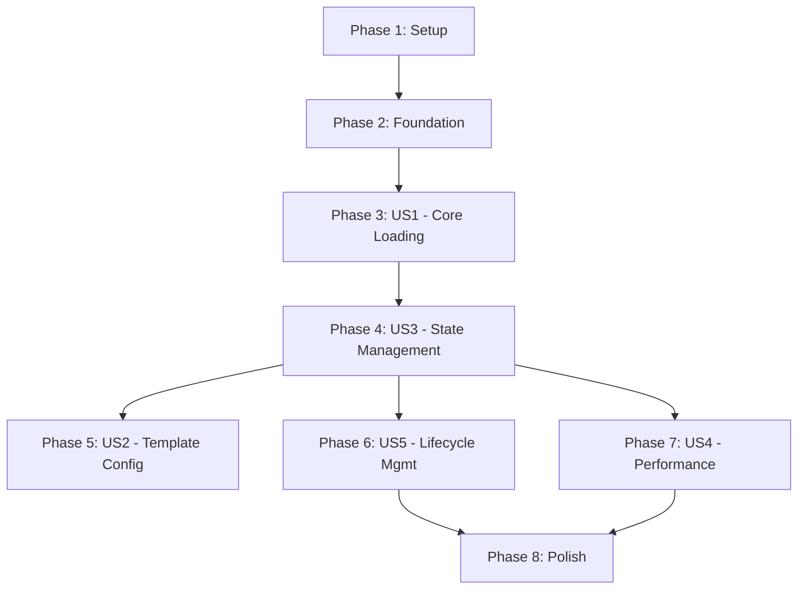

# Task Breakdown: Intelligent Declarative Zsh Framework (Pulse)

**Feature**: 001-build-a-zsh
**Date**: 2025-10-10
**Phase**: 2 (Task Generation)

---

## Overview

This document breaks down the implementation of the Pulse Zsh framework into actionable, independently executable tasks, organized by user story priority.

**Constitution Compliance**:

- **Radical Simplicity**: Tasks focus on a minimal, declarative core.
- **Quality Over Features**: MVP (P1) is lean; enhancements (P3) are deferred.
- **Test-Driven Reliability**: **MANDATORY**. Every implementation task is preceded by a test task.
- **Consistent User Experience**: CLI commands are designed in a dedicated phase.
- **Zero Configuration**: Core loading works out-of-the-box.

---

## Phase 1: Setup

**Goal**: Initialize the basic project structure and files.

- **T001 [Setup] [X]**: Create the main project directory `pulse/`.
- **T002 [Setup] [X]**: Create the directory structure: `lib/` for modules and `tests/` for tests.
- **T003 [Setup] [X]**: Create the main entrypoint file `pulse.zsh` with a placeholder comment.
- **T004 [Setup] [X]**: Create an initial `.gitignore` file to exclude common Zsh and development artifacts (e.g., `*.zwc`, cache files).
- **T005 [Setup] [X]**: Create an initial `README.md` with the project title.

---

## Phase 2: Foundation

**Goal**: Establish the testing framework, a prerequisite for all subsequent development.

- **T006 [Foundation] [X]**: Set up `bats-core` as the integration testing framework in the `tests/` directory.
- **T007 [Foundation] [X]**: Create a test helper library (`tests/test_helper.bash`) for `bats` to mock user configurations (`.zshrc`), files, and environment variables.

---

## Phase 3: User Story 1 - Core Plugin Loading (P1)

**Goal**: Implement the core logic for detecting, classifying, and loading plugins based on the 5-stage pipeline.
**Independent Test Criteria**: The system can load a set of plugins, correctly assigning them to their auto-detected stages ('normal', 'compinit', 'late') and sourcing them in the correct order.

- **T008 [US1] (Test) [X]**: Write integration tests for the plugin loading pipeline.
  - Test case: A standard plugin is loaded in the 'normal' stage.
  - Test case: A completion plugin (e.g., containing `_*` files) is loaded in the 'compinit' stage.
  - Test case: A syntax highlighting plugin is loaded in the 'late' stage.
  - Test case: An invalid plugin path fails gracefully with an error message.
- **T009 [US1] (Implementation) [X]**: Implement the core `plugin-engine.zsh` module in `lib/plugin-engine.zsh`.
  - **T009.1**: Create the 5-stage loading function (`_pulse_load_stages`).
  - **T009.2**: Implement plugin source detection (GitHub `user/repo`, URL, local path).
  - **T009.3**: Implement pattern-based plugin type detection (`_pulse_detect_plugin_type`) based on file patterns.
- **T010 [US1] (Test) [X]**: Write unit tests for the `_pulse_detect_plugin_type` function.
  - Test cases for completion, syntax, theme, and standard plugins.
- **T011 [US1] (Implementation) [X]**: Integrate the `plugin-engine.zsh` module into the main `pulse.zsh` entrypoint.

---

### Checkpoint: User Story 1 Complete

The framework can load plugins.

---

## Phase 4: User Story 3 - Declarative State Management (P1)

**Goal**: Read user configuration from `.zshrc` to control plugin loading.
**Independent Test Criteria**: The framework correctly reads the `plugins`, `pulse_disabled_plugins`, and `pulse_plugin_stage` variables from the environment and alters the loading behavior accordingly.

- **T012 [US3] (Test) [X]**: Write tests for configuration parsing.
  - Test case: The `plugins` array is read correctly.
  - Test case: The `pulse_disabled_plugins` array correctly prevents specific plugins from being loaded.
  - Test case: The `pulse_plugin_stage` associative array correctly overrides a plugin's auto-detected stage.
- **T013 [US3] (Implementation) [X]**: Implement configuration-reading logic in `pulse.zsh` to process `plugins`, `pulse_disabled_plugins`, and `pulse_plugin_stage` before the loading pipeline runs.

---

### Checkpoint: User Story 3 Complete

The framework is now configurable by the user. MVP is complete.

---

## Phase 5: User Story 2 - Template Configuration (P2)

**Goal**: Provide a default `.zshrc` to give users a working setup instantly.
**Independent Test Criteria**: A new user can copy the template to `~/.zshrc`, uncomment a plugin, and have it work on the next shell start.

- **T014 [US2] (Implementation) [X]**: Create a `pulse.zshrc.template` file in the root directory.
  - Include a commented-out `plugins` array with popular examples.
  - Include clear instructions on how to add plugins and source `pulse.zsh`.
- **T015 [US2] (Documentation) [X]**: Update `quickstart.md` to instruct users to copy the template to `~/.zshrc`.

---

### Checkpoint: User Story 2 Complete

The framework is now easier for new users to adopt.

---

## Phase 6: User Story 5 - Plugin Lifecycle Management (P3)

**Goal**: Implement the CLI commands for managing plugins (`install`, `update`, `remove`, `list`, `info`).
**Independent Test Criteria**: Each subcommand (`install`, `update`, etc.) functions according to its contract, and a user can manage their plugins without manually touching the filesystem.

- **T016 [US5] (Test)**: Write integration tests for `pulse install`. [P]
- **T017 [US5] (Implementation)**: Implement `pulse install` command. [P]
- **T018 [US5] (Test)**: Write integration tests for `pulse update`. [P]
- **T019 [US5] (Implementation)**: Implement `pulse update` command. [P]
- **T020 [US5] (Test)**: Write integration tests for `pulse remove`. [P]
- **T021 [US5] (Implementation)**: Implement `pulse remove` command. [P]
- **T022 [US5] (Test)**: Write integration tests for `pulse list` (table and JSON formats). [P]
- **T023 [US5] (Implementation)**: Implement `pulse list` command. [P]
- **T024 [US5] (Test)**: Write integration tests for `pulse info`. [P]
- **T025 [US5] (Implementation)**: Implement `pulse info` command. [P]
- **T026 [US5] (Implementation)**: Create a `completions.zsh` file in `lib/` for all `pulse` subcommands and integrate it.

---

### Checkpoint: User Story 5 Complete

The framework has a full suite of plugin management tools.

---

## Phase 7: User Story 4 - Performance Optimization (P3)

**Goal**: Implement caching and lazy-loading to ensure fast shell startup.
**Independent Test Criteria**: Startup time with a cached configuration is measurably faster. A deferred plugin does not source any files until its trigger command is run.

- **T027 [US4] (Test)**: Write tests for the caching system.
- **T028 [US4] (Implementation)**: Implement the plugin metadata cache in `lib/cache.zsh`.
- **T029 [US4] (Implementation)**: Implement the `pulse cache clear` command.
- **T030 [US4] (Test)**: Write tests for the lazy-loading mechanism.
- **T031 [US4] (Implementation)**: Implement the deferred loading mechanism (`_pulse_defer_plugin`) in `lib/defer.zsh`.
- **T032 [US4] (Implementation)**: Implement the `pulse benchmark` command.

---

### Checkpoint: User Story 4 Complete

The framework is now optimized for performance.

---

## Phase 8: Polish & Diagnostics

**Goal**: Build tools to help users troubleshoot their configuration and finalize the project.

- **T033 [Polish] (Test)**: Write tests for `pulse doctor`.
- **T034 [Polish] (Implementation)**: Implement `pulse doctor` command.
- **T035 [Polish] (Test)**: Write tests for `pulse validate`.
- **T036 [Polish] (Implementation)**: Implement `pulse validate` command.
- **T037 [Polish] (Implementation)**: Implement `PULSE_DEBUG=1` functionality for verbose logging throughout the codebase.
- **T038 [Polish] (Documentation)**: Review and finalize all user-facing documentation (`README.md`, `quickstart.md`).

---

## Dependencies

The user stories can be completed in the following order. P1 stories form the MVP.

- **MVP**: `Setup` → `Foundation` → `US1` → `US3`

## Parallel Execution Examples

- **Within Phase 6 (US5)**: The implementation of `pulse install`, `pulse update`, `pulse remove`, `pulse list`, and `pulse info` are largely independent. Their tests and implementation tasks (`T016` through `T025`) can be worked on in parallel.
- **Across P3 Stories**: Once the MVP (`US1` & `US3`) is complete, work on `US5` (Lifecycle) and `US4` (Performance) can happen concurrently, as they touch different parts of the system (CLI commands vs. core loading engine).

## Implementation Strategy

The project will be delivered incrementally, following the user story priorities.

1. **MVP (P1 Stories)**: First, deliver a working, configurable plugin loader (`US1` + `US3`). This is the core product.
2. **Usability (P2 Story)**: Next, add the template configuration (`US2`) to improve the new user experience.
3. **Enhancements (P3 Stories)**: Finally, implement the advanced features (`US5` and `US4`) and diagnostics. This can be done in any order or in parallel.

This strategy ensures a functional core is available as early as possible, with features added in order of importance.
