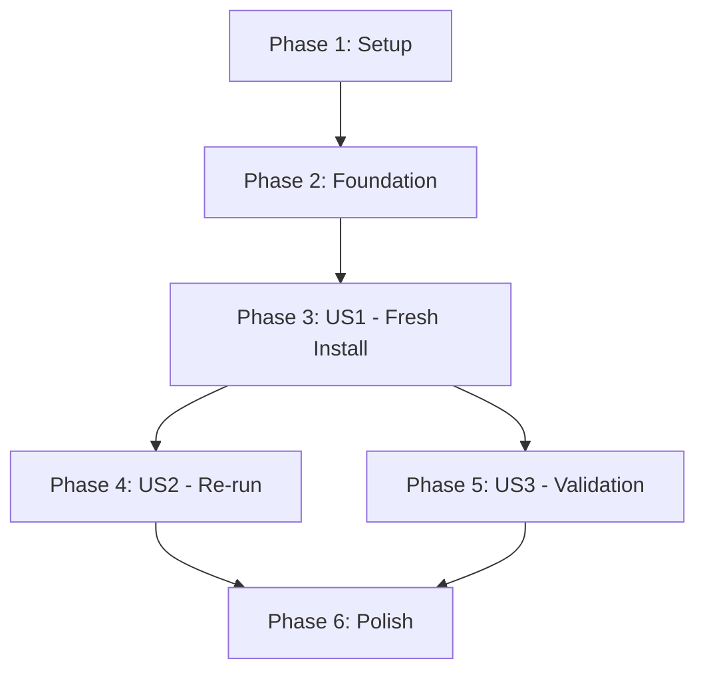

# Task List: Pulse Zero-Config Install Script

**Feature**: 003-implement-an-install
**Branch**: `003-implement-an-install`
**Generated**: 2025-10-12

## Overview

This task list breaks down the installer implementation into executable units organized by user story priority. Following **Test-Driven Development (TDD) - ABSOLUTE REQUIREMENT per Constitution v1.2.0**, tests are written FIRST and MUST FAIL before implementation for each story.

**Total Tasks**: 29 (27 original + 2 foundation TDD tasks added during remediation)
**User Stories**: 3 (P1, P2, P3)
**Parallel Opportunities**: 8 tasks marked [P]
**Estimated Delivery**: 3 phases (MVP = Phase 3 only)

**Constitution Compliance**: This task list enforces the MANDATORY Red-Green-Refactor cycle:

- 🔴 **RED**: Write failing tests that define desired behavior
- ✅ **GREEN**: Write minimal code to make tests pass
- ♻️ **REFACTOR**: Improve code while maintaining passing tests

**Remediation Note**: Tasks T003.5 and T007.5 added to enforce ABSOLUTE REQUIREMENT TDD from constitution for foundation utilities.

## Progress Update (2025-10-13)

- [X] T007 — Fresh install verification confirms `PULSE_VERSION` is exported (tests updated in `tests/install/foundation.bats`).
- [X] Constitution v1.2.0 alignment — Updated task list to reflect ABSOLUTE REQUIREMENT for TDD with explicit Red-Green-Refactor cycle enforcement.

---

## Implementation Strategy

**MVP Scope**: Phase 3 only (User Story 1 - One Command Install)
Delivers core value: working single-command installer for fresh installs.

**Incremental Delivery**:

1. **Phase 3**: US1 - Fresh installation capability (MVP)
2. **Phase 4**: US2 - Idempotent re-run and update detection
3. **Phase 5**: US3 - Comprehensive prerequisite validation
4. **Phase 6**: Polish and documentation finalization

Each phase is independently testable and delivers complete user value.

---

## Phase 1: Project Setup

Foundation for all development work.

### T001: Create project structure [P]

**Story**: Setup
**File**: `scripts/pulse-install.sh`, `docs/install/`, `tests/install/`

```bash
# Create directories
mkdir -p scripts
mkdir -p docs/install
mkdir -p tests/install

# Create placeholder files
touch scripts/pulse-install.sh
touch docs/install/QUICKSTART.md
touch docs/install/TROUBLESHOOTING.md
chmod +x scripts/pulse-install.sh
```

**Acceptance**: Directory structure matches plan.md project structure section.

---

### T002: Set up bats-core test framework [P]

**Story**: Setup
**File**: `tests/install/test_helper.bash`

Install bats-core (if not present) and create test helper with common fixtures:

```bash
# Helper functions for tests
setup_clean_environment() {
  export TEST_HOME=$(mktemp -d)
  export HOME=$TEST_HOME
}

teardown_test_environment() {
  rm -rf "$TEST_HOME"
}
```

**Acceptance**: `bats --version` succeeds; helper loads in test files.

**Dependencies**: None

---

### T003: Configure CI workflow (optional) [P]

**Story**: Setup
**File**: `.github/workflows/install.yml`

GitHub Actions workflow to run installer tests in container:

```yaml
name: Installer Tests
on: [push, pull_request]
jobs:
  test:
    runs-on: ubuntu-latest
    steps:
      - uses: actions/checkout@v3
      - run: tests/install/*.bats
```

**Acceptance**: Workflow file validates; can be triggered manually.

**Dependencies**: T002

---

## Phase 2: Foundational Components

Core utilities needed by all user stories.

### T003.5: [Foundation] Write tests for output formatting functions

**Story**: Foundation TDD
**File**: `tests/install/foundation.bats`

**TDD**: Test First (ABSOLUTE REQUIREMENT per Constitution v1.2.0) - 🔴 RED phase

```bash
@test "print_header outputs formatted header" {
  source scripts/pulse-install.sh
  run print_header
  [ "$status" -eq 0 ]
  [[ "$output" =~ "Pulse" ]]
}

@test "print_step outputs checkmark and step text" {
  source scripts/pulse-install.sh
  run print_step "Test step"
  [ "$status" -eq 0 ]
  [[ "$output" =~ "✓" ]]
  [[ "$output" =~ "Test step" ]]
}

@test "print_error outputs error marker and text" {
  source scripts/pulse-install.sh
  run print_error "Test error"
  [ "$status" -eq 0 ]
  [[ "$output" =~ "✗" ]]
  [[ "$output" =~ "Test error" ]]
}

@test "print_success outputs success banner" {
  source scripts/pulse-install.sh
  run print_success
  [ "$status" -eq 0 ]
  [[ "$output" =~ "Success" ]]
}
```

**Acceptance**: Tests fail (Red phase - no implementation yet).

**Dependencies**: T002

---

### T004: Implement output formatting functions

**Story**: Foundational
**File**: `scripts/pulse-install.sh`

Create functions for consistent output (per installer-behavior.md contract):

```bash
print_header() { ... }
print_step() { ... }    # [✓] step text
print_error() { ... }   # [✗] error text
print_success() { ... } # Success banner
```

**Acceptance**: Functions produce formatted output matching contract examples; T003.5 tests pass (Green phase).

**Dependencies**: T003.5

---

### T005: Implement exit code handling

**Story**: Foundational
**File**: `scripts/pulse-install.sh`

Define exit codes and error function (per installer-behavior.md):

```bash
EXIT_SUCCESS=0
EXIT_PREREQ_FAILED=1
EXIT_INSTALL_FAILED=2
EXIT_CONFIG_FAILED=3
EXIT_VERIFY_FAILED=4
EXIT_USER_CANCELLED=5

error_exit() {
  local code=$1
  local message=$2
  print_error "$message"
  exit "$code"
}
```

**Acceptance**: Calling `error_exit 1 "test"` exits with code 1 and prints message.

**Dependencies**: T004

---

### T006: Implement environment variable parsing

**Story**: Foundational
**File**: `scripts/pulse-install.sh`

Parse optional environment variables (per installer-behavior.md):

```bash
PULSE_INSTALL_DIR="${PULSE_INSTALL_DIR:-$HOME/.local/share/pulse}"
PULSE_ZSHRC="${PULSE_ZSHRC:-$HOME/.zshrc}"
PULSE_SKIP_BACKUP="${PULSE_SKIP_BACKUP:-false}"
PULSE_DEBUG="${PULSE_DEBUG:-false}"
PULSE_SKIP_VERIFY="${PULSE_SKIP_VERIFY:-false}"
```

**Acceptance**: Variables default correctly; custom values override defaults.

**Dependencies**: None

---

## Phase 3: User Story 1 - One Command Install (P1) 🎯 MVP

**Goal**: New users can run one command to install Pulse and start using it immediately.

**Independent Test**: Run installer on clean system; verify Pulse loads in new shell.

---

### T007.5: [Foundation] Write tests for prerequisite check functions

**Story**: Foundation TDD
**File**: `tests/install/foundation.bats`

**TDD**: Test First (ABSOLUTE REQUIREMENT per Constitution v1.2.0) - 🔴 RED phase

```bash
@test "check_zsh_version succeeds with Zsh 5.0+" {
  source scripts/pulse-install.sh
  run check_zsh_version
  [ "$status" -eq 0 ]
}

@test "check_git succeeds when git available" {
  source scripts/pulse-install.sh
  run check_git
  [ "$status" -eq 0 ]
}

@test "check_write_permissions succeeds for writable directory" {
  source scripts/pulse-install.sh
  mkdir -p "$TEST_HOME/writable"
  run check_write_permissions "$TEST_HOME/writable"
  [ "$status" -eq 0 ]
}

@test "check_write_permissions fails for unwritable directory" {
  source scripts/pulse-install.sh
  run check_write_permissions "/root/unwritable"
  [ "$status" -ne 0 ]
}
```

**Acceptance**: Tests fail (Red phase - no implementation yet).

**Dependencies**: T002

---

### T007: [US1] Write test - Fresh installation succeeds

**Story**: US1
**File**: `tests/install/fresh_install.bats`

**TDD**: Test First

```bash
@test "fresh install completes successfully" {
  run scripts/pulse-install.sh
  [ "$status" -eq 0 ]
  [ -d "$HOME/.local/share/pulse" ]
  [ -f "$HOME/.zshrc" ]
  grep -q "BEGIN Pulse Configuration" "$HOME/.zshrc"
}

@test "plugins array comes before source statement" {
  scripts/pulse-install.sh
  PLUGINS_LINE=$(grep -n "plugins=" "$HOME/.zshrc" | head -1 | cut -d: -f1)
  SOURCE_LINE=$(grep -n "source.*pulse.zsh" "$HOME/.zshrc" | head -1 | cut -d: -f1)
  [ "$PLUGINS_LINE" -lt "$SOURCE_LINE" ]
}

@test "installed Pulse loads in new shell" {
  scripts/pulse-install.sh
  run zsh -c 'source ~/.zshrc; echo $PULSE_VERSION'
  [ "$status" -eq 0 ]
  [[ "$output" =~ [0-9]+\.[0-9]+\.[0-9]+ ]]
}
```

**Acceptance**: Tests fail (Red phase - no implementation yet).

**Dependencies**: T002

---

### T008: [US1] Implement Zsh version check [P]

**Story**: US1
**File**: `scripts/pulse-install.sh`

```bash
check_zsh_version() {
  if ! command -v zsh >/dev/null 2>&1; then
    return 1
  fi

  local version=$(zsh --version | grep -oE '[0-9]+\.[0-9]+' | head -1)
  local major=$(echo "$version" | cut -d. -f1)

  [ "$major" -ge 5 ]
}
```

**Acceptance**: Returns 0 for Zsh ≥5.0, non-zero otherwise; T007.5 Zsh test passes (Green phase).

**Dependencies**: T007.5

---

### T009: [US1] Implement Git availability check [P]

**Story**: US1
**File**: `scripts/pulse-install.sh`

```bash
check_git() {
  command -v git >/dev/null 2>&1
}
```

**Acceptance**: Returns 0 if `git` found, non-zero otherwise; T007.5 Git test passes (Green phase).

**Dependencies**: T007.5

---

### T010: [US1] Implement write permissions check [P]

**Story**: US1
**File**: `scripts/pulse-install.sh`

```bash
check_write_permissions() {
  local target_dir="$1"
  local parent_dir=$(dirname "$target_dir")

  # Check if parent is writable
  [ -w "$parent_dir" ] || return 1

  # If target exists, check if writable
  if [ -e "$target_dir" ]; then
    [ -w "$target_dir" ]
  else
    return 0
  fi
}
```

**Acceptance**: Returns 0 for writable locations, non-zero otherwise; T007.5 write permission tests pass (Green phase).

**Dependencies**: T007.5

---

### T011: [US1] Implement prerequisite validation orchestration

**Story**: US1
**File**: `scripts/pulse-install.sh`

Orchestrate all prerequisite checks:

```bash
validate_prerequisites() {
  print_step "Checking prerequisites..."

  if ! check_zsh_version; then
    error_exit $EXIT_PREREQ_FAILED "Zsh 5.0+ required"
  fi

  if ! check_git; then
    error_exit $EXIT_PREREQ_FAILED "Git not found. Install: brew/apt-get install git"
  fi

  if ! check_write_permissions "$PULSE_INSTALL_DIR"; then
    error_exit $EXIT_PREREQ_FAILED "Cannot write to $PULSE_INSTALL_DIR"
  fi

  print_step "Prerequisites validated"
}
```

**Acceptance**: Function calls all checks; exits with code 1 on any failure.

**Dependencies**: T008, T009, T010

---

### T012: [US1] Implement Pulse repository clone

**Story**: US1
**File**: `scripts/pulse-install.sh`

```bash
install_pulse() {
  print_step "Installing Pulse..."

  if [ -d "$PULSE_INSTALL_DIR/.git" ]; then
    cd "$PULSE_INSTALL_DIR"
    git pull origin main
  else
    git clone https://github.com/astrosteveo/pulse.git "$PULSE_INSTALL_DIR"
  fi

  if [ $? -ne 0 ]; then
    error_exit $EXIT_INSTALL_FAILED "Failed to clone Pulse repository"
  fi

  print_step "Installation complete: $PULSE_INSTALL_DIR"
}
```

**Acceptance**: Clones repo to install dir; handles existing installations.

**Dependencies**: T011

---

### T013: [US1] Implement .zshrc backup creation

**Story**: US1
**File**: `scripts/pulse-install.sh`

```bash
backup_zshrc() {
  if [ "$PULSE_SKIP_BACKUP" = "true" ]; then
    return 0
  fi

  if [ -f "$PULSE_ZSHRC" ]; then
    local backup_path="${PULSE_ZSHRC}.pulse-backup-$(date +%Y%m%d-%H%M%S)"
    cp -p "$PULSE_ZSHRC" "$backup_path" || return 1
    echo "Backup created: $backup_path"
  fi
}
```

**Acceptance**: Creates timestamped backup; skips if file doesn't exist.

**Dependencies**: T006

---

### T014: [US1] Implement Pulse block generation

**Story**: US1
**File**: `scripts/pulse-install.sh`

Generate Pulse configuration block (per configuration-patching.md):

```bash
generate_pulse_block() {
  cat <<'EOF'

# BEGIN Pulse Configuration
# Automatically added by Pulse installer on $(date -I)
# Learn more: https://github.com/astrosteveo/pulse

# Declare plugins array (add your plugins here)
plugins=(
  # user/repo syntax for GitHub plugins
  # zsh-users/zsh-autosuggestions
  # zsh-users/zsh-syntax-highlighting
)

# Source Pulse framework
source "$HOME/.local/share/pulse/pulse.zsh"

# END Pulse Configuration
EOF
}
```

**Acceptance**: Function outputs correctly formatted block.

**Dependencies**: None

---

### T015: [US1] Implement .zshrc configuration patching

**Story**: US1
**File**: `scripts/pulse-install.sh`

Patch `.zshrc` with Pulse block (per configuration-patching.md contract):

```bash
patch_zshrc() {
  print_step "Configuring Zsh..."

  backup_zshrc || error_exit $EXIT_CONFIG_FAILED "Backup failed"

  # Check if block exists
  if grep -q "BEGIN Pulse Configuration" "$PULSE_ZSHRC" 2>/dev/null; then
    print_step "Pulse configuration already present"
    return 0
  fi

  # Create if doesn't exist
  touch "$PULSE_ZSHRC"

  # Append block
  generate_pulse_block >> "$PULSE_ZSHRC"

  print_step "Added Pulse configuration block to $PULSE_ZSHRC"
}
```

**Acceptance**: Adds block to `.zshrc`; idempotent (doesn't duplicate).

**Dependencies**: T013, T014

---

### T016: [US1] Implement configuration order validation

**Story**: US1
**File**: `scripts/pulse-install.sh`

Validate plugins-before-source order (per patching contract SG4):

```bash
validate_config_order() {
  local config_file="$1"

  local plugins_line=$(grep -n "plugins=" "$config_file" | head -1 | cut -d: -f1)
  local source_line=$(grep -n "source.*pulse.zsh" "$config_file" | head -1 | cut -d: -f1)

  [ -n "$plugins_line" ] || return 1
  [ -n "$source_line" ] || return 1
  [ "$plugins_line" -lt "$source_line" ]
}
```

**Acceptance**: Returns 0 if order correct, non-zero otherwise.

**Dependencies**: T015

---

### T017: [US1] Implement post-install verification

**Story**: US1
**File**: `scripts/pulse-install.sh`

Verify Pulse loads (per installer-behavior.md G5):

```bash
verify_installation() {
  if [ "$PULSE_SKIP_VERIFY" = "true" ]; then
    return 0
  fi

  print_step "Verifying installation..."

  # Test in subshell
  if zsh -c "source $PULSE_ZSHRC; echo PULSE_OK" 2>/dev/null | grep -q "PULSE_OK"; then
    print_step "Pulse loads successfully in test shell"
    return 0
  else
    error_exit $EXIT_VERIFY_FAILED "Verification failed. Restore backup and retry with PULSE_DEBUG=1"
  fi
}
```

**Acceptance**: Launches subshell to test; exits with code 4 on failure.

**Dependencies**: T016

---

### T018: [US1] Implement main installer orchestration

**Story**: US1
**File**: `scripts/pulse-install.sh`

Main entry point orchestrating all steps:

```bash
main() {
  print_header

  validate_prerequisites
  install_pulse
  patch_zshrc
  validate_config_order "$PULSE_ZSHRC" || error_exit $EXIT_CONFIG_FAILED "Config order invalid"
  verify_installation

  print_success
  echo "Next steps:"
  echo "  1. Restart your shell: exec zsh"
  echo "  2. Verify Pulse is loaded: echo \$PULSE_VERSION"

  exit $EXIT_SUCCESS
}

main "$@"
```

**Acceptance**: Runs all steps in order; exits with code 0 on success.

**Dependencies**: T011, T012, T015, T016, T017

---

### T019: [US1] Run tests and verify Green phase

**Story**: US1
**File**: `tests/install/fresh_install.bats`

**TDD**: Green Phase

```bash
bats tests/install/fresh_install.bats
```

**Acceptance**: All T007 tests pass (status 0, structure valid, order correct).

**Dependencies**: T018

---

### T020: [US1] Write installation quickstart documentation

**Story**: US1
**File**: `docs/install/QUICKSTART.md`

User-facing documentation based on quickstart.md user journeys:

- One-command installation instructions
- What happens during install
- Next steps after completion
- Troubleshooting common issues

**Acceptance**: Documentation mirrors installer output; includes curl|sh command.

**Dependencies**: T019

---

**CHECKPOINT**: `git commit -m "feat(installer): US1 - one-command install complete"`

---

## Phase 4: User Story 2 - Safe Re-run & Detection (P2)

**Goal**: Users can safely re-run installer to update/repair without breaking config.

**Independent Test**: Run installer twice; verify no duplication and preservation of customizations.

---

### T021: [US2] Write test - Idempotent re-run

**Story**: US2
**File**: `tests/install/rerun_idempotent.bats`

**TDD**: Test First

```bash
@test "second install detects existing installation" {
  scripts/pulse-install.sh
  run scripts/pulse-install.sh
  [ "$status" -eq 0 ]
  [[ "$output" =~ "already present" ]]
}

@test "no duplicate configuration blocks after re-run" {
  scripts/pulse-install.sh
  scripts/pulse-install.sh
  COUNT=$(grep -c "BEGIN Pulse Configuration" "$HOME/.zshrc")
  [ "$COUNT" -eq 1 ]
}

@test "user plugin customizations preserved" {
  scripts/pulse-install.sh
  # User adds plugin
  sed -i '/plugins=(/a \  zsh-users/zsh-autosuggestions' "$HOME/.zshrc"
  scripts/pulse-install.sh
  grep -q "zsh-users/zsh-autosuggestions" "$HOME/.zshrc"
}

@test "wrong configuration order is auto-fixed" {
  scripts/pulse-install.sh
  # Manually corrupt order (source before plugins)
  sed -i '/BEGIN Pulse Configuration/,/END Pulse Configuration/{
    /plugins=/h
    /source.*pulse.zsh/H
    /source.*pulse.zsh/{ g; p; }
    /plugins=/d
  }' "$HOME/.zshrc"

  # Re-run installer
  scripts/pulse-install.sh

  # Verify order is now correct
  PLUGINS_LINE=$(grep -n "plugins=" "$HOME/.zshrc" | head -1 | cut -d: -f1)
  SOURCE_LINE=$(grep -n "source.*pulse.zsh" "$HOME/.zshrc" | head -1 | cut -d: -f1)
  [ "$PLUGINS_LINE" -lt "$SOURCE_LINE" ]
}
```

**Acceptance**: Tests fail (Red phase - auto-fix logic not implemented).

**Dependencies**: T002, T019

---

### T022: [US2] Implement existing installation detection

**Story**: US2
**File**: `scripts/pulse-install.sh`

Enhance `install_pulse` to detect and update existing installations:

```bash
install_pulse() {
  print_step "Installing Pulse..."

  if [ -d "$PULSE_INSTALL_DIR/.git" ]; then
    print_step "Existing installation detected: $PULSE_INSTALL_DIR"
    cd "$PULSE_INSTALL_DIR"
    git pull --quiet origin main || error_exit $EXIT_INSTALL_FAILED "Update failed"
    print_step "Update complete: $PULSE_INSTALL_DIR"
  else
    git clone --quiet https://github.com/astrosteveo/pulse.git "$PULSE_INSTALL_DIR" || \
      error_exit $EXIT_INSTALL_FAILED "Clone failed"
    print_step "Installation complete: $PULSE_INSTALL_DIR"
  fi
}
```

**Acceptance**: Detects existing .git directory; pulls updates instead of cloning.

**Dependencies**: T012

---

### T023: [US2] Enhance configuration patching for updates

**Story**: US2
**File**: `scripts/pulse-install.sh`

Update `patch_zshrc` to preserve user modifications and **auto-fix wrong order (FR-004)**:

```bash
patch_zshrc() {
  print_step "Configuring Zsh..."

  backup_zshrc || error_exit $EXIT_CONFIG_FAILED "Backup failed"

  if grep -q "BEGIN Pulse Configuration" "$PULSE_ZSHRC" 2>/dev/null; then
    print_step "Existing Pulse configuration detected"

    # Check if order is correct
    if validate_config_order "$PULSE_ZSHRC"; then
      print_step "Configuration already correct (no changes needed)"
      return 0
    fi

    # Order is wrong - auto-fix per FR-004
    print_step "Detected incorrect configuration order - auto-fixing..."

    # Extract user plugins from existing block
    local user_plugins=$(sed -n '/BEGIN Pulse Configuration/,/END Pulse Configuration/p' "$PULSE_ZSHRC" | \
                         sed -n '/plugins=(/,/)/p' | \
                         grep -v 'plugins=\|)' | \
                         sed 's/^[[:space:]]*//')

    # Remove old block
    sed -i '/BEGIN Pulse Configuration/,/END Pulse Configuration/d' "$PULSE_ZSHRC"

    # Insert corrected block with preserved plugins
    cat >> "$PULSE_ZSHRC" << EOF

# BEGIN Pulse Configuration
# Automatically updated by Pulse installer on $(date -I)
# Learn more: https://github.com/astrosteveo/pulse

# Declare plugins array (add your plugins here)
plugins=(
$user_plugins
)

# Source Pulse framework
source "$PULSE_INSTALL_DIR/pulse.zsh"

# END Pulse Configuration
EOF

    print_step "Fixed configuration order (plugins now before source)"
    return 0
  fi

  # No existing block - add new one
  touch "$PULSE_ZSHRC"
  generate_pulse_block >> "$PULSE_ZSHRC"
  print_step "Added Pulse configuration block to $PULSE_ZSHRC"
}
```

**Acceptance**: Detects existing block; auto-fixes wrong order; preserves user plugins; validates final order.

**Dependencies**: T015, T016

---

### T024: [US2] Run tests and verify Green phase

**Story**: US2
**File**: `tests/install/rerun_idempotent.bats`

**TDD**: Green Phase

```bash
bats tests/install/rerun_idempotent.bats
```

**Acceptance**: All T021 tests pass (idempotent, no duplication, preserves customizations).

**Dependencies**: T022, T023

---

**CHECKPOINT**: `git commit -m "feat(installer): US2 - idempotent re-run complete"`

---

## Phase 5: User Story 3 - Environment Validation (P3)

**Goal**: Installer validates prerequisites and provides helpful guidance on failures.

**Independent Test**: Run installer with missing prerequisites; verify helpful error messages.

---

### T025: [US3] Write test - Prerequisite failure handling

**Story**: US3
**File**: `tests/install/failure_modes.bats`

**TDD**: Test First

```bash
@test "missing git produces helpful error" {
  # Hide git from PATH
  PATH=/usr/bin:/bin
  run scripts/pulse-install.sh
  [ "$status" -eq 1 ]
  [[ "$output" =~ "Git not found" ]]
  [[ "$output" =~ "brew install git" ]] || [[ "$output" =~ "apt-get install git" ]]
}

@test "unwritable directory produces helpful error" {
  PULSE_INSTALL_DIR=/root/pulse
  run scripts/pulse-install.sh
  [ "$status" -eq 1 ]
  [[ "$output" =~ "Cannot write" ]]
}

@test "prerequisite failure exits before file changes" {
  PATH=/usr/bin:/bin  # Hide git
  run scripts/pulse-install.sh
  [ "$status" -eq 1 ]
  [ ! -f "$HOME/.zshrc.pulse-backup"* ]  # No backup created
}
```

**Acceptance**: Tests fail (Red phase - enhanced error messages not implemented).

**Dependencies**: T002, T024

---

### T026: [US3] Enhance prerequisite checks with remediation

**Story**: US3
**File**: `scripts/pulse-install.sh`

Add detailed error messages (per installer-behavior.md):

```bash
validate_prerequisites() {
  print_step "Checking prerequisites..."

  if ! check_zsh_version; then
    cat >&2 <<EOF

Error: Zsh 5.0+ is required

To fix this issue:
  • macOS: brew install zsh
  • Ubuntu/Debian: sudo apt-get install zsh
  • Fedora/RHEL: sudo dnf install zsh

After installing Zsh, re-run this installer.
EOF
    exit $EXIT_PREREQ_FAILED
  fi

  print_step "Zsh version: $(zsh --version | grep -oE '[0-9]+\.[0-9]+' | head -1) (required: ≥5.0)"

  if ! check_git; then
    cat >&2 <<EOF

Error: Git is not installed on this system

To fix this issue:
  • macOS: brew install git
  • Ubuntu/Debian: sudo apt-get install git
  • Fedora/RHEL: sudo dnf install git

After installing Git, re-run this installer.

For more help, visit: https://github.com/astrosteveo/pulse/docs/install/TROUBLESHOOTING.md
EOF
    exit $EXIT_PREREQ_FAILED
  fi

  print_step "Git: found at $(command -v git)"

  if ! check_write_permissions "$PULSE_INSTALL_DIR"; then
    cat >&2 <<EOF

Error: Cannot write to install directory: $PULSE_INSTALL_DIR

To fix this issue:
  • Choose a different directory: PULSE_INSTALL_DIR=~/my-pulse ./pulse-install.sh
  • Create the parent directory: mkdir -p $(dirname "$PULSE_INSTALL_DIR")

For more help, visit: https://github.com/astrosteveo/pulse/docs/install/TROUBLESHOOTING.md
EOF
    exit $EXIT_PREREQ_FAILED
  fi

  print_step "Install directory: $PULSE_INSTALL_DIR (writable)"
  print_step "Prerequisites validated"
}
```

**Acceptance**: Each check prints helpful remediation; exits before file changes.

**Dependencies**: T011

---

### T027: [US3] Run tests and verify Green phase

**Story**: US3
**File**: `tests/install/failure_modes.bats`

**TDD**: Green Phase

```bash
bats tests/install/failure_modes.bats
```

**Acceptance**: All T025 tests pass (helpful errors, no partial state on failure).

**Dependencies**: T026

---

**CHECKPOINT**: `git commit -m "feat(installer): US3 - prerequisite validation complete"`

---

## Phase 6: Polish & Documentation

Cross-cutting concerns and finalization.

### Documentation Tasks [P]

All documentation tasks can run in parallel:

- Finalize `docs/install/QUICKSTART.md` with all user stories
- Create `docs/install/TROUBLESHOOTING.md` with common issues and solutions
- Update main `README.md` with prominent installation instructions
- Add inline documentation to `scripts/pulse-install.sh`

### Testing Tasks [P]

- Add performance benchmarks (120s target for installation)
- Add platform-specific tests (macOS vs Linux differences)
- Validate CI workflow runs all tests

**CHECKPOINT**: `git commit -m "docs(installer): complete installation documentation"`

---

## Dependencies

### User Story Dependencies



**Critical Path**: Setup → Foundation → US1 → Polish

**Parallel Paths**: US2 and US3 can develop independently after US1

---

## Parallel Execution Examples

### Phase 3 (US1) Parallelization

```bash
# Can run in parallel (different concerns):
T008: Zsh check       [P]
T009: Git check       [P]
T010: Write check     [P]

# After T011 completes:
T020: Documentation   [P] (while T012-T019 execute)
```

### Phase 6 (Polish) Parallelization

```bash
# All documentation tasks:
- QUICKSTART.md       [P]
- TROUBLESHOOTING.md  [P]
- README.md updates   [P]
- Inline docs         [P]

# All testing tasks:
- Performance tests   [P]
- Platform tests      [P]
- CI validation       [P]
```

---

## Task Summary by User Story

| Story | Priority | Task Count | Key Deliverable |
|-------|----------|------------|-----------------|
| Setup | - | 3 | Project structure + test framework |
| Foundation TDD | - | 2 | Test-first specs for foundation utilities (T003.5, T007.5) |
| Foundation | - | 3 | Output formatting, exit codes, env vars |
| US1 | P1 | 14 | Working one-command installer (MVP) |
| US2 | P2 | 4 | Idempotent re-run with auto-fix capability |
| US3 | P3 | 3 | Enhanced prerequisite validation |
| Polish | - | ~6 | Documentation and testing finalization |

**Total**: 29+ tasks

---

## TDD Enforcement Policy (Constitution v1.2.0)

**ZERO TOLERANCE**: The following rules are MANDATORY and NON-NEGOTIABLE:

1. **BLOCK**: No implementation task begins until tests are written and failing (RED phase verified)
2. **VERIFY RED**: Tests MUST fail before implementation (confirms tests work correctly)
3. **VERIFY GREEN**: Tests MUST pass after implementation (confirms implementation works)
4. **VERIFY REFACTOR**: Tests MUST still pass after refactoring (confirms no regressions)
5. **REJECT**: Pull requests without tests are rejected without review—no exceptions
6. **DOCUMENT**: If tests fail unexpectedly, update spec first, then tests, then implementation

**Red-Green-Refactor Cycle** (repeat for each task marked with TDD):

```text
1. 🔴 RED: Write test → Run test → Verify FAILS (exit code ≠ 0)
2. ✅ GREEN: Write code → Run test → Verify PASSES (exit code = 0)
3. ♻️ REFACTOR: Improve code → Run test → Verify STILL PASSES
```

**Test Coverage Targets**:

- **100%** of critical paths (install, upgrade, rollback)
- **90%** of error handling branches
- **Cross-platform**: Linux + macOS minimum

---

## Success Validation

After completing all phases, verify success criteria from spec.md:

- **SC-001**: Time fresh install (target: <120s)
- **SC-002**: Run config order validation test (target: 100% pass)
- **SC-003**: Count manual intervention prompts (target: <5%)
- **SC-004**: Track support ticket volume post-release (target: -60%)

---

## Next Steps

1. Begin with **Phase 1-3 for MVP** (T001-T020)
2. **Verify RED phase** for each test task before proceeding to implementation
3. **Verify GREEN phase** after each implementation task
4. Checkpoint after US1 completion
5. Continue with US2 and US3 as enhancements
6. Finalize with polish phase

**Ready to implement**: Start with T001 (project structure creation)

**Remember**: Tests FIRST, implementation SECOND, refactor THIRD. No exceptions.
