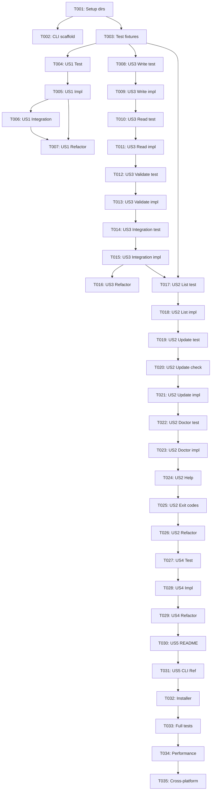

# Task List: Polish & Refinement

**Feature**: 004-polish-and-refinement
**Branch**: `004-polish-and-refinement`
**Created**: 2025-10-14

---

## Overview

This task list breaks down the polish and refinement feature into executable, test-driven tasks organized by user story. Each user story represents an independently testable increment of functionality.

**Total Tasks**: 31
**Test-Driven**: All implementation follows Red-Green-Refactor cycle
**Organization**: Tasks grouped by user story (US1-US5) for independent delivery

---

## Implementation Strategy

### MVP Scope (Minimum Viable Product)

**User Story 1 (US1)** - `@latest` keyword support

- Provides immediate value: explicit version management
- Foundational for other features
- Small, well-defined scope
- Estimated: 2-4 hours

### Incremental Delivery

1. **MVP**: US1 (@latest keyword) - Can ship immediately
2. **Phase 2**: US3 (Lock file) - Enables reproducibility
3. **Phase 3**: US2 (CLI commands) - User-facing convenience
4. **Phase 4**: US4 (Update notifications) - Enhancement
5. **Phase 5**: US5 (Documentation) - Polish

Each phase can be deployed independently without breaking changes.

---

## Phase 1: Setup & Infrastructure

These tasks prepare the project for all user stories.

### T001: [Setup] Create CLI directory structure ✅

**File**: Create directories
**Story**: Infrastructure
**Type**: Setup

**Actions**:

```bash
mkdir -p bin
mkdir -p lib/cli/commands
mkdir -p lib/cli/lib
mkdir -p tests/integration
mkdir -p tests/unit
```

**Validation**:

- All directories exist
- Directory structure matches plan.md

**Dependencies**: None

---

### T002: [Setup] Create CLI entry point scaffold ✅

**File**: `bin/pulse`
**Story**: Infrastructure
**Type**: Setup

**Actions**:

1. Create `bin/pulse` with shebang `#!/usr/bin/env zsh`
2. Add basic argument parsing structure
3. Add command dispatcher (case statement)
4. Make executable: `chmod +x bin/pulse`

**Validation**:

- File exists and is executable
- Running `bin/pulse` displays help message
- Invalid command shows error

**Dependencies**: T001

---

## Phase 2: Foundational Tasks

These tasks must complete before ANY user story can be implemented.

---

### T003: [Setup] Create test fixtures ✅

**File**: `tests/fixtures/mock-plugins/`
**Story**: Infrastructure
**Type**: Setup

**Actions**:

1. Create `tests/fixtures/mock-plugins/` directory
2. Initialize mock plugin repos:
   - `plugin-a/` with multiple tags (v1.0, v1.1, v2.0)
   - `plugin-b/` with branches (main, develop)
   - `plugin-c/` with specific commits
3. Add setup script to initialize git repos

**Validation**:

- Mock plugin directories exist
- Each has valid .git directory
- Tags/branches are available

**Dependencies**: T001

---

## Phase 3: User Story 1 - @latest Keyword

**Goal**: Support explicit `@latest` in plugin declarations for self-documenting configuration.

**Independent Test**: Add plugin with `user/repo@latest`, verify it clones default branch.

**Tasks**: 4 (T004-T007)

### T004: [US1] [TEST] Write failing test for @latest parsing

**File**: `tests/unit/version_parsing.bats`
**Story**: US1
**Type**: Test (RED)
**Parallel**: [P] with other test files

**Actions**:

1. Create `tests/unit/version_parsing.bats`
2. Write test: "parses @latest as empty ref"
   - Input: `zsh-users/plugin@latest`
   - Expected: `plugin_ref=""` (empty ref = default branch)
3. Write test: "@latest behaves identically to omitted version"
   - Input: `zsh-users/plugin@latest` vs `zsh-users/plugin`
   - Expected: Both produce same `plugin_ref`
4. Run test: `bats tests/unit/version_parsing.bats`
5. **Verify test FAILS** (function doesn't exist yet)

**Validation**:

- Test file created
- Test runs and FAILS with expected error
- Test is repeatable

**Dependencies**: T003

---

### T005: [US1] [IMPL] Add @latest parsing to plugin engine

**File**: `lib/plugin-engine.zsh`
**Story**: US1
**Type**: Implementation (GREEN)

**Actions**:

1. Locate `_pulse_parse_plugin_spec()` function (around line 115-130)
2. Add conditional after extracting `plugin_ref`:

   ```zsh
   # Treat @latest as empty ref (clone default branch)
   if [[ "$plugin_ref" == "latest" ]]; then
     plugin_ref=""
   fi
   ```

3. Run test: `bats tests/unit/version_parsing.bats`
4. **Verify test PASSES**

**Validation**:

- Test passes (GREEN)
- `@latest` treated as empty ref
- Backward compatible (omitted `@` still works)

**Dependencies**: T004

---

### T006: [US1] [TEST] Write integration test for @latest plugin installation

**File**: `tests/integration/version_pinning.bats`
**Story**: US1
**Type**: Test (RED)
**Parallel**: [P] with other test files

**Actions**:

1. Create `tests/integration/version_pinning.bats`
2. Write test: "installs plugin with @latest"
   - Setup: Mock plugin repo with tags
   - Config: `plugins=(mock-user/plugin-a@latest)`
   - Action: Source pulse.zsh
   - Assert: Plugin cloned from default branch
3. Write test: "@latest updates to newest commit"
   - Setup: Plugin installed with @latest
   - Action: Simulate upstream commits
   - Action: Re-source or update mechanism
   - Assert: Latest commit checked out
4. Run test: `bats tests/integration/version_pinning.bats`
5. **Verify test FAILS** (update mechanism not implemented yet)

**Validation**:

- Integration test created
- Test fails with expected behavior
- Mock plugin fixtures used correctly

**Dependencies**: T003, T005

---

### T007: [US1] [REFACTOR] Add error handling for @latest

**File**: `lib/plugin-engine.zsh`
**Story**: US1
**Type**: Refactoring

**Actions**:

1. Add validation: ensure `@latest` doesn't conflict with specific version
2. Add debug output: `[Pulse] Plugin using @latest (default branch)`
3. Run all US1 tests: `bats tests/unit/version_parsing.bats tests/integration/version_pinning.bats`
4. **Verify all tests PASS**

**Validation**:

- All US1 tests pass
- Debug output shows @latest detection
- No regressions in existing tests

**Dependencies**: T005, T006

**CHECKPOINT**: ✅ US1 Complete - @latest keyword functional and tested

---

## Phase 4: User Story 3 - Lock File

**Goal**: Automatic lock file generation for reproducible environments.

**Independent Test**: Install plugins, verify `plugins.lock` created with exact commits.

**Tasks**: 7 (T008-T014)

### T008: [US3] [TEST] Write failing test for lock file write

**File**: `tests/unit/lock_file_format.bats`
**Story**: US3
**Type**: Test (RED)
**Parallel**: [P] with other test files

**Actions**:

1. Create `tests/unit/lock_file_format.bats`
2. Write test: "writes lock entry in INI format"
   - Input: plugin data (name, url, ref, commit, timestamp, stage)
   - Action: Call `pulse_write_lock_entry`
   - Assert: Lock file contains correct INI section
3. Write test: "creates lock file with header if missing"
   - Action: Write first entry to non-existent lock file
   - Assert: File created with version header
4. Run test: `bats tests/unit/lock_file_format.bats`
5. **Verify test FAILS** (function doesn't exist)

**Validation**:

- Test file created
- Test fails with expected error
- INI format expectations documented

**Dependencies**: T003

---

### T009: [US3] [IMPL] Create lock file write functions

**File**: `lib/cli/lib/lock-file.zsh`
**Story**: US3
**Type**: Implementation (GREEN)
**Parallel**: [P] with non-overlapping files

**Actions**:

1. Create `lib/cli/lib/lock-file.zsh`
2. Implement `pulse_write_lock_entry()`:
   - Parameters: plugin_name url ref commit timestamp stage
   - Create lock file with header if missing
   - Append plugin section in INI format
3. Implement `pulse_init_lock_file()`:
   - Create lock file with version header
   - Add timestamp and warning comment
4. Run test: `bats tests/unit/lock_file_format.bats`
5. **Verify test PASSES**

**Validation**:

- Tests pass (GREEN)
- Lock file created with correct format
- INI sections properly formatted

**Dependencies**: T008

---

### T010: [US3] [TEST] Write failing test for lock file read

**File**: `tests/unit/lock_file_format.bats`
**Story**: US3
**Type**: Test (RED)

**Actions**:

1. Add test: "reads all plugin sections from lock file"
   - Setup: Create lock file with 3 plugin sections
   - Action: Call `pulse_read_lock_file`
   - Assert: Returns array of 3 plugin names
2. Add test: "reads specific field from plugin section"
   - Setup: Lock file with plugin data
   - Action: Call `pulse_get_plugin_field "plugin-a" "commit"`
   - Assert: Returns correct commit SHA
3. Run test: `bats tests/unit/lock_file_format.bats`
4. **Verify test FAILS** (read functions don't exist)

**Validation**:

- New tests fail as expected
- Test data uses valid INI format

**Dependencies**: T009

---

### T011: [US3] [IMPL] Create lock file read functions

**File**: `lib/cli/lib/lock-file.zsh`
**Story**: US3
**Type**: Implementation (GREEN)

**Actions**:

1. Implement `pulse_read_lock_file()`:
   - Use awk to extract all section names
   - Return array of plugin names
2. Implement `pulse_get_plugin_field()`:
   - Parameters: plugin_name field_name
   - Use awk to find section and extract field value
   - Return field value or empty string
3. Run test: `bats tests/unit/lock_file_format.bats`
4. **Verify all tests PASS**

**Validation**:

- All lock file tests pass
- Read/write operations symmetric
- Handles missing files gracefully

**Dependencies**: T010

---

### T012: [US3] [TEST] Write failing test for lock file validation

**File**: `tests/unit/lock_file_format.bats`
**Story**: US3
**Type**: Test (RED)

**Actions**:

1. Add test: "validates lock file format"
   - Setup: Lock file with valid format
   - Action: Call `pulse_validate_lock_file`
   - Assert: Returns 0 (success)
2. Add test: "detects missing version header"
   - Setup: Lock file without header
   - Action: Call `pulse_validate_lock_file`
   - Assert: Returns 1, error message to stderr
3. Add test: "detects invalid commit SHA"
   - Setup: Lock file with malformed commit
   - Action: Call `pulse_validate_lock_file`
   - Assert: Returns 1, specific error message
4. Run test: `bats tests/unit/lock_file_format.bats`
5. **Verify tests FAIL**

**Validation**:

- Validation tests fail as expected
- Error cases documented

**Dependencies**: T011

---

### T013: [US3] [IMPL] Implement lock file validation

**File**: `lib/cli/lib/lock-file.zsh`
**Story**: US3
**Type**: Implementation (GREEN)

**Actions**:

1. Implement `pulse_validate_lock_file()`:
   - Check version header exists
   - For each section, validate required fields present
   - Validate commit SHA format (40-char hex)
   - Validate timestamp format (ISO8601)
   - Validate stage is one of allowed values
   - Print specific errors to stderr
   - Return 0 if valid, 1 if invalid
2. Run test: `bats tests/unit/lock_file_format.bats`
3. **Verify all tests PASS**

**Validation**:

- All validation tests pass
- Error messages are clear and actionable
- Performance <10ms for typical lock files

**Dependencies**: T012

---

### T014: [US3] [TEST] Write integration test for automatic lock file generation

**File**: `tests/integration/lock_file_workflow.bats`
**Story**: US3
**Type**: Test (RED)
**Parallel**: [P] with other integration test files

**Actions**:

1. Create `tests/integration/lock_file_workflow.bats`
2. Write test: "generates lock file on plugin installation"
   - Setup: Clean environment, no lock file
   - Config: `plugins=(mock-user/plugin-a@v1.0)`
   - Action: Source pulse.zsh
   - Assert: Lock file created
   - Assert: Lock file contains plugin-a entry with v1.0
3. Write test: "updates lock file on plugin update"
   - Setup: Plugin installed with lock file
   - Action: Change plugin to @latest, re-source
   - Assert: Lock file updated with new commit
4. Write test: "regenerates corrupted lock file"
   - Setup: Create invalid lock file
   - Action: Source pulse.zsh
   - Assert: Lock file regenerated
   - Assert: Warning message displayed
5. Run test: `bats tests/integration/lock_file_workflow.bats`
6. **Verify tests FAIL** (integration not wired up)

**Validation**:

- Integration tests created
- Tests fail appropriately
- Scenarios cover acceptance criteria

**Dependencies**: T013

---

### T015: [US3] [IMPL] Integrate lock file generation into plugin engine

**File**: `lib/plugin-engine.zsh`
**Story**: US3
**Type**: Implementation (GREEN)

**Actions**:

1. Source `lib/cli/lib/lock-file.zsh` at top of plugin-engine.zsh
2. In `_pulse_load_plugin()`, after successful clone:
   - Extract commit SHA: `git -C "$plugin_path" rev-parse HEAD`
   - Get current timestamp: `date -u +%Y-%m-%dT%H:%M:%SZ`
   - Call `pulse_write_lock_entry "$plugin_name" "$plugin_url" "$plugin_ref" "$commit" "$timestamp" "$stage"`
3. On framework load, check lock file validity:
   - If invalid, call regeneration logic
   - Scan installed plugins, recreate lock entries
4. Run test: `bats tests/integration/lock_file_workflow.bats`
5. **Verify tests PASS**

**Validation**:

- Integration tests pass
- Lock file generated automatically
- Corruption recovery works
- No performance regression (<10ms overhead)

**Dependencies**: T014

---

### T016: [US3] [REFACTOR] Add lock file debug output

**File**: `lib/plugin-engine.zsh`, `lib/cli/lib/lock-file.zsh`
**Story**: US3
**Type**: Refactoring

**Actions**:

1. Add debug output: `[Pulse] Lock file created at $lock_path`
2. Add debug output: `[Pulse] Lock file updated for $plugin_name`
3. Add debug output: `[Pulse] Lock file invalid, regenerating...`
4. Run all US3 tests
5. **Verify all tests PASS**

**Validation**:

- All US3 tests pass
- Debug output helpful for troubleshooting
- No regressions

**Dependencies**: T015

**CHECKPOINT**: ✅ US3 Complete - Lock file generation functional and tested

---

## Phase 5: User Story 2 - CLI Commands

**Goal**: Provide CLI commands for plugin management (list, update, doctor).

**Independent Test**: Run `pulse list` to see plugins, `pulse update` to update them.

**Tasks**: 10 (T017-T026)

### T017: [US2] [TEST] Write failing test for pulse list command

**File**: `tests/integration/cli_commands.bats`
**Story**: US2
**Type**: Test (RED)
**Parallel**: [P] with other test files

**Actions**:

1. Create `tests/integration/cli_commands.bats`
2. Write test: "pulse list shows installed plugins in table format"
   - Setup: 3 plugins installed with lock file
   - Action: Run `bin/pulse list`
   - Assert: Output contains 3 plugin names
   - Assert: Output contains version/ref for each
   - Assert: Output formatted as table
3. Write test: "pulse list with no plugins shows helpful message"
   - Setup: Clean environment
   - Action: Run `bin/pulse list`
   - Assert: Exit code 2
   - Assert: Message "No plugins installed"
4. Run test: `bats tests/integration/cli_commands.bats`
5. **Verify tests FAIL** (command not implemented)

**Validation**:

- Tests created
- Tests fail appropriately
- Expected output format documented

**Dependencies**: T003, T015 (requires lock file)

---

### T018: [US2] [IMPL] Implement pulse list command

**File**: `lib/cli/commands/list.zsh`
**Story**: US2
**Type**: Implementation (GREEN)
**Parallel**: [P] with other command files

**Actions**:

1. Create `lib/cli/commands/list.zsh`
2. Implement `_pulse_cmd_list()`:
   - Check if lock file exists
   - Read all plugin sections
   - For each plugin, extract: name, ref, commit (truncated to 7 chars)
   - Format as table with headers: PLUGIN | VERSION | COMMIT
   - Sort alphabetically by name
3. Wire into `bin/pulse` dispatcher:
   - Add case: `list) source lib/cli/commands/list.zsh; _pulse_cmd_list "$@" ;;`
4. Run test: `bats tests/integration/cli_commands.bats`
5. **Verify list tests PASS**

**Validation**:

- List command tests pass
- Table format readable
- Exit code 0 on success, 2 if no plugins

**Dependencies**: T017

---

### T019: [US2] [TEST] Write failing test for pulse update command

**File**: `tests/integration/cli_commands.bats`
**Story**: US2
**Type**: Test (RED)

**Actions**:

1. Add test: "pulse update updates all outdated plugins"
   - Setup: 2 plugins installed, 1 outdated
   - Action: Run `bin/pulse update`
   - Assert: Outdated plugin updated
   - Assert: Up-to-date plugin unchanged
   - Assert: Lock file updated
2. Add test: "pulse update <plugin> updates only specified plugin"
   - Setup: 2 plugins installed, both outdated
   - Action: Run `bin/pulse update plugin-a`
   - Assert: Only plugin-a updated
   - Assert: plugin-b unchanged
3. Add test: "pulse update skips plugin with local changes"
   - Setup: Plugin with uncommitted changes
   - Action: Run `bin/pulse update`
   - Assert: Plugin skipped with warning
   - Assert: Exit code 0 (success, skipped safely)
4. Add test: "pulse update --force updates plugin with local changes"
   - Setup: Plugin with uncommitted changes
   - Action: Run `bin/pulse update --force`
   - Assert: Plugin updated despite local changes
5. Run test: `bats tests/integration/cli_commands.bats`
6. **Verify tests FAIL**

**Validation**:

- Update tests created
- Tests fail as expected
- Scenarios cover acceptance criteria

**Dependencies**: T018

---

### T020: [US2] [IMPL] Create update checking logic

**File**: `lib/cli/lib/update-check.zsh`
**Story**: US2
**Type**: Implementation (GREEN)
**Parallel**: [P] with command files

**Actions**:

1. Create `lib/cli/lib/update-check.zsh`
2. Implement `pulse_check_updates()`:
   - Parameters: plugin_name url ref
   - Check cache: `$PULSE_DIR/.update-cache/$plugin_name.cache`
   - If cache fresh (<24h), use cached data
   - If stale, run: `git ls-remote --heads --tags "$url"`
   - Parse output, find matching ref
   - Return remote commit SHA
   - Update cache with timestamp and results
3. Implement `pulse_needs_update()`:
   - Compare local commit vs remote commit
   - Return 0 if update available, 1 if up-to-date
4. Test manually with mock plugin
5. **Verify functions work**

**Validation**:

- Functions implemented
- Cache mechanism works
- Network failure handled gracefully

**Dependencies**: T019

---

### T021: [US2] [IMPL] Implement pulse update command

**File**: `lib/cli/commands/update.zsh`
**Story**: US2
**Type**: Implementation (GREEN)
**Parallel**: [P] with other command files

**Actions**:

1. Create `lib/cli/commands/update.zsh`
2. Source `lib/cli/lib/update-check.zsh` and `lib/cli/lib/lock-file.zsh`
3. Implement `_pulse_cmd_update()`:
   - Parse arguments: [plugin-name] [--force] [--check-only]
   - Acquire lock: `flock` on `$PULSE_DIR/.update.lock`
   - Read lock file, get plugin list
   - Filter to specified plugin if provided
   - For each plugin:
     - Check if local changes exist: `git -C "$path" diff-index --quiet HEAD`
     - If local changes and not --force: skip with warning
     - Check for updates using `pulse_needs_update`
     - If update available and not --check-only:
       - Run: `git -C "$path" pull`
       - Update lock file entry with new commit
   - Release lock
   - Print summary: X updated, Y up-to-date, Z skipped
4. Wire into `bin/pulse` dispatcher
5. Run test: `bats tests/integration/cli_commands.bats`
6. **Verify update tests PASS**

**Validation**:

- Update command tests pass
- Locking prevents concurrent updates
- Local changes handled correctly
- Lock file updated after successful update

**Dependencies**: T020

---

### T022: [US2] [TEST] Write failing test for pulse doctor command

**File**: `tests/integration/cli_commands.bats`
**Story**: US2
**Type**: Test (RED)

**Actions**:

1. Add test: "pulse doctor checks git availability"
   - Action: Run `bin/pulse doctor`
   - Assert: Output contains git check result
   - Assert: Shows git version if available
2. Add test: "pulse doctor checks network connectivity"
   - Action: Run `bin/pulse doctor`
   - Assert: Output contains network check
   - Assert: Shows github.com status
3. Add test: "pulse doctor validates lock file"
   - Setup: Invalid lock file
   - Action: Run `bin/pulse doctor`
   - Assert: Reports lock file invalid
   - Assert: Suggests fix
4. Add test: "pulse doctor shows all checks passed"
   - Setup: Healthy system
   - Action: Run `bin/pulse doctor`
   - Assert: All checks show [✓]
   - Assert: Exit code 0
5. Run test: `bats tests/integration/cli_commands.bats`
6. **Verify tests FAIL**

**Validation**:

- Doctor tests created
- Tests fail appropriately
- Diagnostic checks documented

**Dependencies**: T021

---

### T023: [US2] [IMPL] Implement pulse doctor command

**File**: `lib/cli/commands/doctor.zsh`
**Story**: US2
**Type**: Implementation (GREEN)
**Parallel**: [P] with other command files

**Actions**:

1. Create `lib/cli/commands/doctor.zsh`
2. Source `lib/cli/lib/lock-file.zsh`
3. Implement `_pulse_cmd_doctor()`:
   - Run 8 diagnostic checks:
     1. Git availability: `command -v git`
     2. Network connectivity: `curl -Is https://github.com 2>/dev/null | head -n1`
     3. Plugin directory: `test -d "$PULSE_DIR/plugins"`
     4. Lock file validity: `pulse_validate_lock_file`
     5. Plugin integrity: Check each plugin has .git directory
     6. CLI installation: Check `bin/pulse` exists
     7. PATH configuration: Check if CLI location in PATH
     8. Configuration syntax: Parse .zshrc plugins array
   - For each check: Print [✓] or [✗] with status
   - If check fails: Print actionable fix instruction
   - Count passed vs total
   - Exit 0 if all passed, 1 if any failed
4. Wire into `bin/pulse` dispatcher
5. Run test: `bats tests/integration/cli_commands.bats`
6. **Verify doctor tests PASS**

**Validation**:

- Doctor command tests pass
- All 8 checks implemented
- Output is clear and actionable
- Exit codes correct

**Dependencies**: T022

---

### T024: [US2] [IMPL] Add help system to CLI

**File**: `bin/pulse`
**Story**: US2
**Type**: Implementation (GREEN)

**Actions**:

1. Implement `_pulse_show_help()` function:
   - Print main help message with all commands
   - Show usage examples
2. Implement `_pulse_show_version()` function:
   - Print Pulse version from framework
3. Update dispatcher to handle:
   - `pulse --help` → call `_pulse_show_help`
   - `pulse --version` → call `_pulse_show_version`
   - `pulse list --help` → show list-specific help
   - `pulse update --help` → show update-specific help
   - `pulse doctor --help` → show doctor-specific help
4. Manually test all help commands
5. **Verify help output is clear**

**Validation**:

- Help messages comprehensive
- Examples included
- Version information correct

**Dependencies**: T023

---

### T025: [US2] [TEST] Write test for CLI exit codes

**File**: `tests/integration/cli_commands.bats`
**Story**: US2
**Type**: Test (RED)

**Actions**:

1. Add test: "CLI returns 0 on success"
   - Action: Run `bin/pulse list` (with plugins)
   - Assert: Exit code 0
2. Add test: "CLI returns 1 on general error"
   - Action: Run `bin/pulse update` (network failure)
   - Assert: Exit code 1
3. Add test: "CLI returns 2 on usage error"
   - Action: Run `bin/pulse invalid-command`
   - Assert: Exit code 2
   - Assert: Help message shown
4. Run test: `bats tests/integration/cli_commands.bats`
5. **Verify tests FAIL or PASS** (may already pass from previous tasks)

**Validation**:

- Exit code tests created
- POSIX conventions followed

**Dependencies**: T024

---

### T026: [US2] [REFACTOR] Add error handling and polish to CLI

**File**: `bin/pulse`, all command files
**Story**: US2
**Type**: Refactoring

**Actions**:

1. Add error handling wrapper:
   - Catch command failures
   - Map to appropriate exit codes
   - Print helpful error messages
2. Add security warnings:
   - Detect SSH URLs in lock file
   - Warn if SSH used without known_hosts
   - Suggest HTTPS alternative
3. Add performance optimizations:
   - Minimize git operations
   - Use lock file cache where possible
4. Run all US2 tests
5. **Verify all tests PASS**

**Validation**:

- All US2 tests pass
- Error messages helpful
- Security warnings functional
- Performance meets goals (<2s operations)

**Dependencies**: T025

**CHECKPOINT**: ✅ US2 Complete - CLI commands functional and tested

---

## Phase 6: User Story 4 - Update Notifications

**Goal**: Show available updates for installed plugins.

**Independent Test**: Pin plugin to old version, run `pulse list --outdated`, see updates.

**Tasks**: 3 (T027-T029)

### T027: [US4] [TEST] Write failing test for outdated plugin detection

**File**: `tests/integration/cli_commands.bats`
**Story**: US4
**Type**: Test (RED)

**Actions**:

1. Add test: "pulse list --outdated shows plugins with updates"
   - Setup: 2 plugins, 1 pinned to old version
   - Action: Run `bin/pulse list --outdated`
   - Assert: Shows only outdated plugin
   - Assert: Shows current version
   - Assert: Shows latest available version
2. Add test: "pulse list --outdated shows nothing when all current"
   - Setup: All plugins on latest
   - Action: Run `bin/pulse list --outdated`
   - Assert: Message "All plugins up to date"
3. Run test: `bats tests/integration/cli_commands.bats`
4. **Verify tests FAIL**

**Validation**:

- Tests created
- Tests fail as expected

**Dependencies**: T026 (requires working list command)

---

### T028: [US4] [IMPL] Add --outdated flag to pulse list

**File**: `lib/cli/commands/list.zsh`
**Story**: US4
**Type**: Implementation (GREEN)

**Actions**:

1. Update `_pulse_cmd_list()` to accept `--outdated` flag
2. When `--outdated` specified:
   - For each plugin, call `pulse_needs_update`
   - Filter list to only outdated plugins
   - Show current commit vs latest commit
   - Add column: CURRENT | LATEST
3. If no outdated plugins: print "All plugins up to date"
4. Run test: `bats tests/integration/cli_commands.bats`
5. **Verify tests PASS**

**Validation**:

- Outdated detection tests pass
- Output shows version comparison
- Cache used to minimize network calls

**Dependencies**: T027

---

### T029: [US4] [REFACTOR] Add update information to output

**File**: `lib/cli/commands/list.zsh`
**Story**: US4
**Type**: Refactoring

**Actions**:

1. For outdated plugins, attempt to add release notes link:
   - Parse git tags for semantic versions
   - Find latest stable tag
   - Generate GitHub releases link if available
2. Add color coding if terminal supports it:
   - Green: up to date
   - Yellow: outdated
3. Run all US4 tests
4. **Verify tests PASS**

**Validation**:

- All US4 tests pass
- Release links helpful
- Color coding improves readability

**Dependencies**: T028

**CHECKPOINT**: ✅ US4 Complete - Update notifications functional and tested

---

## Phase 7: User Story 5 - Documentation

**Goal**: Comprehensive documentation of version pinning and CLI features.

**Independent Test**: Read README, find version pinning examples and CLI reference.

**Tasks**: 2 (T030-T031)

### T030: [US5] [DOCS] Update README with version management examples

**File**: `README.md`
**Story**: US5
**Type**: Documentation

**Actions**:

1. Add "Version Management" section:
   - Explain `@latest` keyword with examples
   - Show version pinning with tags: `user/repo@v1.0`
   - Show pinning to branch: `user/repo@develop`
   - Show pinning to commit: `user/repo@abc123...`
   - Explain lock file purpose and location
2. Add "Plugin Management" section:
   - Document `pulse list` command
   - Document `pulse update` command with flags
   - Document `pulse doctor` command
   - Show common workflows
3. Update installation section:
   - Note that CLI is installed automatically
   - Show how to verify CLI installation: `pulse --version`

**Validation**:

- README updated with examples
- Examples tested and accurate
- Clear and beginner-friendly

**Dependencies**: T029 (all features implemented)

---

### T031: [US5] [DOCS] Create CLI reference documentation

**File**: `docs/CLI_REFERENCE.md`
**Story**: US5
**Type**: Documentation

**Actions**:

1. Create `docs/CLI_REFERENCE.md`
2. Document each command:
   - `pulse list` - Synopsis, options, examples, exit codes
   - `pulse update` - Synopsis, options, examples, exit codes
   - `pulse doctor` - Synopsis, checks performed, examples
3. Add troubleshooting section:
   - Common issues and solutions
   - Lock file recovery
   - Network problems
   - Local changes conflicts
4. Add best practices:
   - When to use @latest vs pinning
   - How to manage lock file in dotfiles
   - CI/CD integration examples
5. Cross-reference from README

**Validation**:

- CLI reference complete
- All commands documented
- Examples tested
- Cross-references work

**Dependencies**: T030

**CHECKPOINT**: ✅ US5 Complete - Documentation comprehensive and accurate

---

## Phase 8: Polish & Cross-Cutting Concerns

### T032: [Polish] Update installer script

**File**: `scripts/pulse-install.sh`
**Story**: Cross-cutting
**Type**: Implementation

**Actions**:

1. Add CLI installation step:
   - Create `~/.local/bin` if it doesn't exist
   - Symlink `bin/pulse` to `~/.local/bin/pulse`
   - Check if `~/.local/bin` in PATH
   - If not, show instructions to add it
2. Add verification step:
   - Test `pulse --version` after installation
   - Show success message if working
3. Update installer success message to mention CLI

**Validation**:

- CLI installed by installer
- Symlink created correctly
- PATH instructions shown if needed

**Dependencies**: T031

---

### T033: [Polish] Run full test suite and fix any issues

**File**: All test files
**Story**: Cross-cutting
**Type**: Testing

**Actions**:

1. Run full test suite: `bats tests/unit/*.bats tests/integration/*.bats`
2. Check code coverage:
   - 100% for version parsing
   - 100% for lock file operations
   - 90%+ for CLI commands
3. Fix any failing tests
4. Fix any regressions
5. **Verify all tests PASS**

**Validation**:

- All tests pass
- Coverage targets met
- No known issues

**Dependencies**: T032

---

### T034: [Polish] Performance validation

**File**: All implementation files
**Story**: Cross-cutting
**Type**: Testing

**Actions**:

1. Measure CLI command performance:
   - `time pulse list` with 50 plugins
   - Assert: <2 seconds
2. Measure lock file parsing:
   - Create lock file with 50 plugins
   - Measure parse time
   - Assert: <10ms
3. Measure update check:
   - `time pulse update --check-only`
   - Assert: <5 seconds (with cache)
4. Optimize if targets not met

**Validation**:

- All performance targets met
- No degradation from baseline

**Dependencies**: T033

---

### T035: [Polish] Cross-platform testing

**File**: All test files
**Story**: Cross-cutting
**Type**: Testing

**Actions**:

1. Test on Linux (primary)
2. Test on macOS
3. Test on BSD if available
4. Fix any platform-specific issues:
   - Date command differences
   - GNU vs BSD tools
   - Zsh version differences
5. Document any known platform limitations

**Validation**:

- Tests pass on Linux and macOS
- Platform issues documented
- Graceful degradation if needed

**Dependencies**: T034

**CHECKPOINT**: ✅ All Phases Complete - Feature ready for production

---

## Task Dependencies



---

## Parallel Execution Opportunities

### Within User Story 1 (US1)

- T004 and T006 can run in parallel (different test files)

### Within User Story 3 (US3)

- T008, T010, T012 can run in parallel (same file, but separate test development)
- T009 implementation work is sequential (same file)

### Within User Story 2 (US2)

- T017, T019, T022, T025, T027 can all be developed in parallel (test file additions)
- T018, T020, T023 can run in parallel (different implementation files)

### Example: Parallel Implementation of US2

```bash
# Terminal 1: List command
bats tests/integration/cli_commands.bats -f "pulse list"

# Terminal 2: Update command
bats tests/integration/cli_commands.bats -f "pulse update"

# Terminal 3: Doctor command
bats tests/integration/cli_commands.bats -f "pulse doctor"
```

---

## Test Coverage Summary

### Unit Tests

- **version_parsing.bats** (T004): @latest parsing, backward compatibility
- **lock_file_format.bats** (T008-T013): Write, read, validate operations

### Integration Tests

- **version_pinning.bats** (T006): End-to-end @latest functionality
- **lock_file_workflow.bats** (T014): Automatic generation, updates, recovery
- **cli_commands.bats** (T017-T027): All CLI commands with various scenarios

### Coverage Targets

- **100%**: Version parsing, lock file operations (core functionality)
- **90%**: CLI commands (utilities)
- **Test-First**: All tests written before implementation (Red-Green-Refactor)

---

## Success Criteria

Each user story has independent test criteria from spec.md:

✅ **US1**: Plugin with `@latest` clones from default branch and updates work
✅ **US2**: Commands list, update, and diagnose plugins successfully
✅ **US3**: Lock file created automatically with exact versions
✅ **US4**: `--outdated` flag shows available updates
✅ **US5**: Documentation complete with examples and CLI reference

**Overall Success**: All 35 tasks complete, all tests pass, all checkpoints reached, performance targets met.
